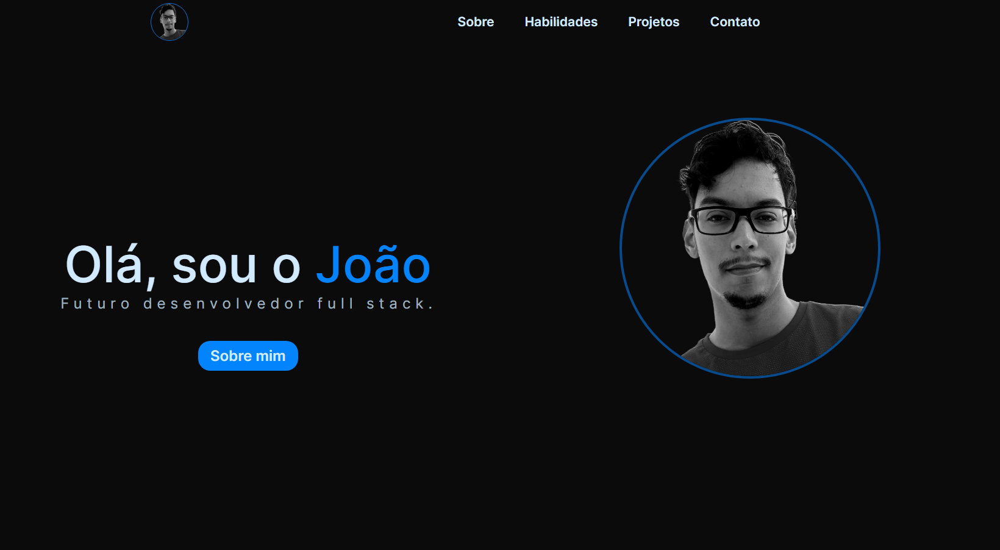

# Portifólio pessoal
Criei este portifólio para mostrar um pouco de minhas habilidades

[Você pode conferir como ficou o projeto aqui](https://joao121gf.github.io/projeto-portifolio/)

## 🛠 Tecnologias
* HTML5
* CSS3
* JavaScript

## Pré-requisitos
Antes de começar, você precisará ter os seguintes softwares instalados em sua máquina:

* Um editor de código (Ex: Visual Studio Code)

## Instalação
Para instalar e visualizar a tela de login, siga as seguintes etapas:

Clone o repositório do GitHub em sua máquina local.
Abra o arquivo index.html em seu editor de código.
Visualize o arquivo index.html em seu navegador.

## Autor
João Giovani - https://github.com/joao121gf

## 💬Contato
* https://github.com/joao121gf
* https://www.linkedin.com/in/jo%C3%A3o-giovani-657192204/

## Licença
Este projeto está licenciado sob a licença MIT - consulte o arquivo LICENSE.md para obter detalhes.

